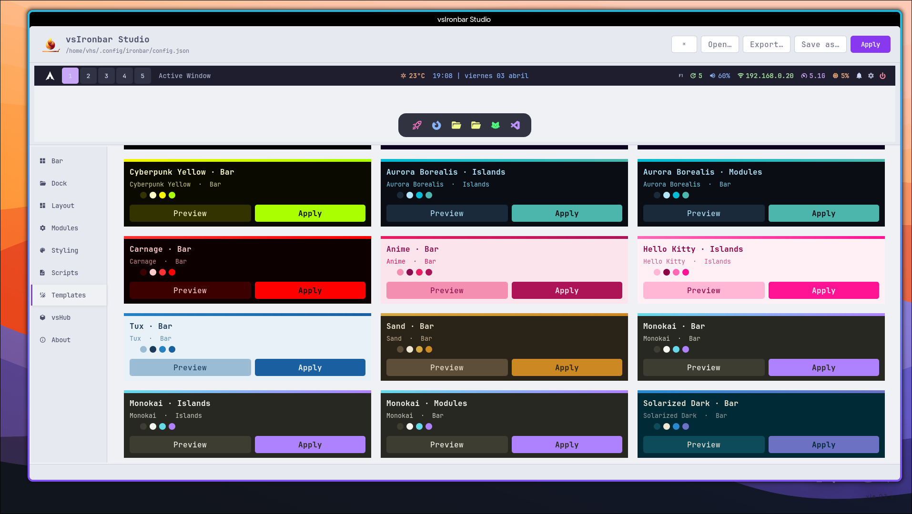
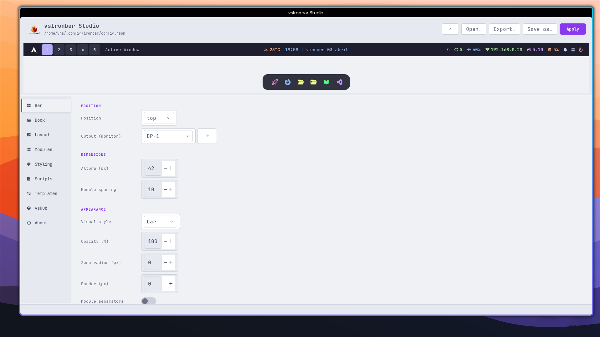
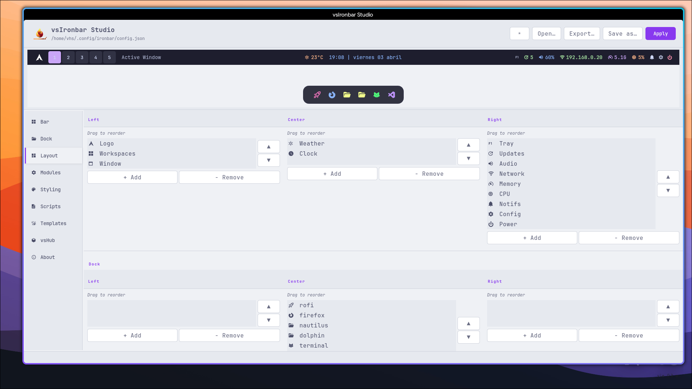
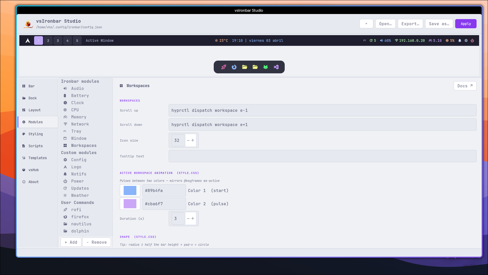
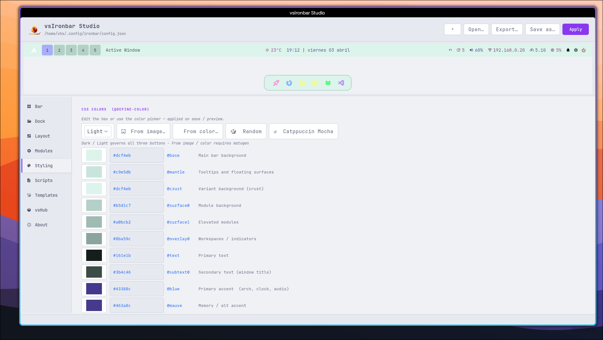

<h1 align="center">vsIronBar Studio</h1>

<p align="center">
  
</p>

[](https://aur.archlinux.org/packages/vsironbar-studio)
[](LICENSE)

vsIronBar Studio is a visual editor for [Ironbar](https://github.com/JakeStanger/ironbar) — build, style and preview your bar in real time.

No more editing JSON and CSS by hand. Design your Ironbar with live feedback, templates and full module control.

> Available on the AUR as [`vsironbar-studio`](https://aur.archlinux.org/packages/vsironbar-studio).
> Single-file Python 3 + GTK3 application.

---

## Who is it for?

vsIronBar-Studio is aimed at users who want a good-looking Ironbar quickly, especially when starting with Hyprland or a fresh Wayland setup.

It is not trying to replace a hand-crafted advanced workflow. The goal is to make bar and dock configuration approachable, faster to iterate on, and safer to save.

The editor can also coexist with manual edits: it reads an existing setup on startup, preserves blocks it does not understand, and writes them back instead of dropping them.

---

## Screenshots

### Templates


### Bar Settings


### Layout Editor


### Module Config


### Styling


---

## Version 1 Features

- **Live preview** - embedded WebKit preview that renders the bar and dock together with real CSS
- **Bar and Dock editors** - configure position, output, height, spacing, margins, layer, opacity, radius, font and separators
- **Layout editor** - move modules between left, center and right zones for both the main bar and the dock
- **Modules tab** - edit supported Ironbar modules with dedicated forms
- **Named instances** - detect entries such as `battery#bat2` and edit them from the UI
- **User Commands** - create custom `custom/<name>` launcher modules with icon, color, tooltip and click action
- **Styling tools** - edit 14 CSS color tokens, font settings, padding and shape values
- **Templates** - 54 ready-made templates across 36 palettes and multiple visual styles
- **Palette tools** - random palettes plus [matugen](https://github.com/InioX/matugen) integration for palette extraction from image or base color
- **Scripts tab** - edit bundled helper scripts such as `weather.py` and `weather.sh`
- **Weather setup UI** - write `~/.config/ironbar/weather.conf` directly from the Modules tab
- **Safe saves** - Apply writes config and CSS, restarts Ironbar, and creates timestamped backups
- **Original snapshot backup** - first save also stores an untouched copy under `~/.config/ironbar/backups/original/`
- **JSONC-friendly loading** - handles comments and trailing commas in common Ironbar JSON configs
- **Unknown block preservation** - keeps unrecognized config sections instead of discarding them
- **vsHub** - built-in tab for discovering and launching related tools from the same ecosystem

---

## Requirements

- Python 3.10+
- `python-gobject` / PyGObject for GTK3
- `python-cairo`
- WebKitGTK with GI bindings (`WebKit2` 4.0 or 4.1)
- [Ironbar](https://github.com/JakeStanger/ironbar)

Optional integrations:

- [Hyprland](https://github.com/hyprwm/Hyprland) for `hyprland/workspaces` and `hyprland/window`
- [matugen](https://github.com/InioX/matugen) for palette generation
- [swaync](https://github.com/ErikReider/SwayNotificationCenter) for notifications
- [wlogout](https://github.com/ArtsyMacaw/wlogout) for the power menu
- `kitty` for the default updates action
- `pavucontrol` for the default PulseAudio action
- `network-manager-applet` / `nm-connection-editor` for the default network action
- `pacman-contrib` for the updates counter on Arch Linux

---

## Installation

### AUR

```bash
yay -S vsironbar-studio
# or
paru -S vsironbar-studio
```

### Manual

```bash
git clone https://github.com/victorsosaMx/vsIronbar-Studio
cd vsIronbar-Studio
chmod +x vsironbar-studio
./vsironbar-studio
```

By default the app works with:

- `~/.config/ironbar/config.json`
- `~/.config/ironbar/style.css`

If `IRONBAR_CONFIG` or `IRONBAR_CSS` are set, those paths are used instead.
You can also open a different config and stylesheet from the UI.

---

## Quick Start

1. Launch `vsironbar-studio`.
2. Pick a template or start from the default bar and dock.
3. Arrange modules in the **Layout** tab.
4. Adjust module behavior in **Modules**.
5. Tune colors and typography in **Styling**.
6. Click **Apply** to write files and restart Ironbar.

---

## Weather Module

The bundled weather module uses `weather.py` and reads its credentials from `~/.config/ironbar/weather.conf`.

### Setup

1. Create a free API key at [OpenWeatherMap](https://openweathermap.org/api).
2. Open **Modules** and select **Weather**.
3. Fill in API key, city and units.
4. Click **Save weather.conf**.
5. Open **Scripts** and save `weather.py` if you want the bundled script copied into your Ironbar scripts directory.
6. Click **Apply**.

The API key is stored in `weather.conf`, not inside the script.

---

## Backups

Every save operation creates timestamped backups under:

```text
~/.config/ironbar/backups/
```

Version 1 also keeps an initial untouched snapshot in:

```text
~/.config/ironbar/backups/original/
```

This makes rollback straightforward if you want to compare or restore previous files.

---

## License

MIT.
